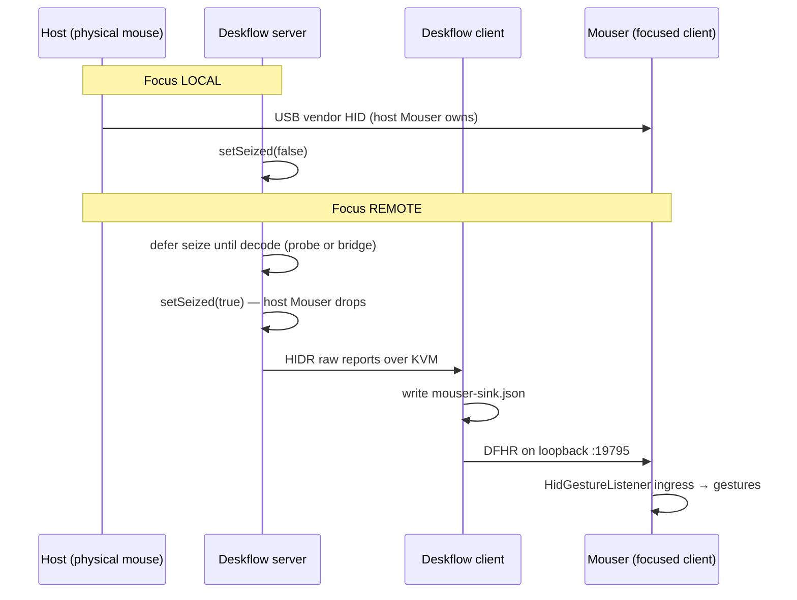

## Phase 0 KVM transparency live soak — Standard

## Overview

Validate end-to-end KVM transparency on **two real macOS machines** (Hackintosh host + MacBook client, or equivalent): Deskflow HID passthrough seizes vendor HID on the host when focus is remote, forwards raw DFHR frames to Mouser on the focused client, and Mouser decodes gestures through the Tier 1.5 listener ingress path — **without** manual `remote_device` / `remote_forward` configuration.

Code for Phases 1–3 and review fixes is implemented locally but **uncommitted**. This plan covers build/deploy, config, soak execution, sign-off, and a fix loop for anything that fails live.

## Problem Statement / Motivation

Unit tests pass (Mouser 872 tests; Deskflow `HidConsumerTests`), and architecture review is clean after fixes — but **no live two-machine proof** yet. Phase 0 is the gate before calling Tier 1.5 “done” and before retiring host Mouser bridge when `HidppProbe` succeeds.

Without soak we cannot confirm:

- Host seize actually disconnects host Mouser when focus is remote
- Client auto-detect (`mouser-sink.json` → Mouser sink) works without manual tokens
- Gesture/thumb/wheel behavior matches local-USB expectations on the focused machine
- Crash/focus-return recovery (Deskflow quit → USB back within 2s)

## Proposed Solution

Execute the existing soak checklist with corrected configs, freshly built binaries from both repos, structured logging capture, and explicit pass/fail sign-off against roadmap acceptance criteria.



## Technical Considerations

### Architecture (unchanged — validate, don’t redesign)

| Layer | Host (mouse attached) | Client (focused) |
|-------|----------------------|------------------|
| HID ownership | `HidPassthrough` seize on vendor FF00+ when remote focus | No USB; `DeskflowSinkDevice` queue |
| Transport | Deskflow KVM → `HIDR` / consumer protocol | `MouserClient` DFHR → `RemoteDeviceServer` |
| Decode | `HidppProbe` (preferred) or host Mouser bridge fallback | `connect.decode` + listener `_seed_from_decode` |
| Mouser config | Defaults + `deskflow.auto: true` only | Same — no manual `remote_*` |

### Build requirements

- **Deskflow:** Rebuild after review fixes (`MouserClient` EAGAIN, `HidppProbeMac` run loop, `HidppProbeWin` caps, manifest lifecycle). Run `HidConsumerTests`; add `HidppProbeTests` to build if missing from target.
- **Mouser:** Run from `working` with review fixes (`remote_device` DFHR resync, thread-safe decode, sink flush, attach wait).

### Config fix (checklist typo)

`deskflow/docs/plan/2026-06-30-phase-0-soak-checklist.md` line 19 merges two keys — correct host `[server]` block:

```ini
[server]
hidPassthroughEnabled=true
hidPassthroughDevices=046D:B042
mouserBridgeEnabled=true
mouserBridgePort=19796
mouserBridgeToken=<shared-bridge-secret>
```

(Client uses separate `mouserToken` for sink — see checklist remote section.)

### Security / permissions

- macOS TCC: **Accessibility** for `deskflow-core` and Mouser on both machines
- Sharing secret must match (Deskflow GUI → Sharing)
- Loopback tokens: auto-generated by GUI preferred; if manual, bridge token ≠ sink token

### Performance

- Soak target: 30+ minutes continuous focus switching without stuck state
- Watch for DFHR backpressure (fixed `sendAll` retry) under high report rate

## Implementation Tasks

### Phase A — Prep (both repos, this machine)

- [x] **A1.** Confirm branches: Mouser `working`, Deskflow `master`; note uncommitted diff for rollback if needed
- [x] **A2.** Mouser: KVM tests 18/18 pass; full suite green
- [x] **A3.** Deskflow: `HidConsumerTests` 9/9, `HidppProbeTests` 5/5; `deskflow-core` built (`build-test/bin/Deskflow.app/.../deskflow-core`)
- [x] **A4.** Fix soak checklist config typo (`2026-06-30-phase-0-soak-checklist.md` host `[server]` block)
- [ ] **A5.** Deploy same build to second machine (rsync or rebuild there)

### Phase B — Machine setup

**Host (mouse physically attached — e.g. Hackintosh)**

- [ ] **B1.** Deskflow server role; HID passthrough ON; device `046D:B042` (adjust PID)
- [ ] **B2.** Auto switch ON (optional but recommended)
- [ ] **B3.** Mouser running with default config; verify **no** `remote_device.enabled` / `remote_forward.enabled` overrides
- [ ] **B4.** First soak variant **with probe:** disable host `remote_forward` after confirming probe log: `host HID++ probe populated decode cache`
- [ ] **B5.** Fallback variant **without probe:** keep host Mouser + decode-only bridge enabled

**Client (focused machine — e.g. MacBook)**

- [ ] **B6.** Deskflow client; `client/mouserEnabled=true` (or passthrough checkbox enables it)
- [ ] **B7.** Mouser running; defaults only
- [ ] **B8.** After client connects to host, verify `~/Library/Application Support/Deskflow/mouser-sink.json` exists

### Phase C — Soak execution (ordered)

| Step | Action | Pass signal |
|------|--------|-------------|
| C1 | Focus **local** on host | Host gestures work; `[HidGesture]` connected to USB |
| C2 | Move focus **remote** | Host Mouser disconnect log; client shows device `source: hidapi`, not `remote-virtual` |
| C3 | Swipe gesture on remote | Configured action fires (Mission Control, etc.) |
| C4 | Scroll wheel on remote | KVM scroll works; firmware invert unchanged on remote (expected) |
| C5 | Return focus to **host** | Gestures + firmware invert restore within **2s** |
| C6 | `killall deskflow-core` on host | Host Mouser recovers USB; no ghost virtual device on client |
| C7 | Restart Deskflow | Decode republish; remote gestures work again |
| C8 | Logs on client | `Deskflow HID sink auto-enabled` (or equivalent engine message) |
| C9 | 30+ min mixed use | No stuck focus, no ghost device, no token errors |

### Phase D — Sign-off & follow-up

- [ ] **D1.** Mark Phase 0 criteria in `deskflow/docs/plan/2026-06-30-kvm-transparency-roadmap-plan.md`
- [ ] **D2.** Record probe outcome: host Mouser required yes/no
- [ ] **D3.** File issues for any soak failures; link logs
- [ ] **D4.** If pass: commit both repos with coordinated message; optional tag `kvm-tier-1.5-soak`

## Acceptance Criteria

### Must pass (Phase 0 / Tier 1)

- [ ] Gesture swipes fire on **focused machine only**; host silent while remote focused
- [ ] Wheel scroll follows KVM; invert behavior matches roadmap (host-only firmware invert)
- [ ] Deskflow quit → Mouser recovers local USB within **2 seconds**
- [ ] No steady-state full semantic relay (`remote_forward.should_forward()` false when not bridging events)
- [ ] Client Mouser works with **default config** + Deskflow only (no manual loopback tokens in `config.json`)

### Should pass (Tier 1.5 transparency)

- [ ] Device UI shows product name + `source: hidapi` / `transport: USB Receiver`
- [ ] `mouser-sink.json` drives auto-start; removing manifest stops auto sink
- [ ] Host `HidppProbe` populates decode → host Mouser bridge can stay off

### Explicit non-goals (this soak)

- Linux host grab (stub — out of scope)
- Tier 2 virtual HID / Options+ compatibility
- Firmware invert on remote focus (documented impossible in Tier 1/1.5)

## Success Metrics

| Metric | Target |
|--------|--------|
| Soak duration | ≥ 30 minutes uninterrupted |
| Focus-return recovery | ≤ 2s to host gestures |
| Crash recovery | ≤ 2s to host USB after `killall deskflow-core` |
| Config surface | Zero manual `remote_*` on client; host bridge optional when probe works |
| Test regression | Mouser full suite green; Deskflow unit tests green |

## Failure Triage

| Symptom | Likely cause | Check |
|---------|--------------|-------|
| Remote gestures dead | Missing `decode.feat_idx` | Host probe log or bridge `update_decode`; client `connect` payload |
| Host gestures while remote focused | Seize not active | `hidPassthroughEnabled`; focus on remote screen; host Mouser still connected |
| Token / hello rejected | Token mismatch | Sink token (client) vs bridge token (host) vs Mouser auto-detect |
| Binary reports ignored | Version skew | Both repos rebuilt with DFHR; Mouser `test_remote_binary_frames` |
| Attach timeout | Listener not ready | `request_deskflow_attach` 5s wait; USB probe blocking — check logs |
| Probe always fails (macOS) | Run loop / device contention | `HidppProbeMac` fix deployed; host Mouser not holding device during probe window |

## Dependencies & Risks

| Risk | Mitigation |
|------|------------|
| Uncommitted code drift between machines | Same commit/build on both; or rsync built artifacts |
| Hackintosh IOHID quirks | Document platform; fall back to host bridge |
| TCC not granted | Pre-flight Accessibility check before soak |
| Two tokens confused | Use GUI auto-token; label bridge vs sink in notes |
| Phase 0 fails | Fix loop → re-run C1–C9; do not proceed to Phase 4 |

## References & Research

### Local (implemented)

- Mouser: `core/deskflow_integration.py`, `core/hid_deskflow_backend.py`, `core/hid_gesture.py` (Deskflow attach), `core/remote_device.py` (DFHR multiplex)
- Deskflow: `src/lib/server/HidPassthrough.*`, `src/lib/server/OSXHidGrabber.mm`, `src/lib/client/MouserClient.cpp`, `src/lib/server/HidppProbe*.cpp/mm`
- Review reports: `Mouser/docs/code-review/*.md`

### Docs

- `deskflow/docs/hid-passthrough.md` — seize semantics, focus-driven grab
- `deskflow/docs/plan/2026-06-30-kvm-transparency-roadmap-plan.md` — phase status
- `deskflow/docs/plan/2026-06-30-phase-0-soak-checklist.md` — step list (fix typo in Phase A4)

### External research

Skipped — strong local context; macOS IOHID seize behavior documented in-repo.

## User Flow Summary

1. User enables Deskflow passthrough + sharing on host; Mouser on both machines with defaults.
2. User works on host → local gestures behave as today.
3. User moves cursor to client → host vendor HID seized; client receives virtual “USB” device via sink.
4. User uses gestures on client → Mouser actions fire on client only.
5. User returns to host → seize releases; host Mouser reopens USB.
6. Deskflow crash/quit → host immediately regains device (OS releases seize).

**Edge cases covered in soak:** focus flip during gesture hold, rapid focus switching, Deskflow restart, manifest stale after disconnect (verify `stopMouserHidDelivery` clears JSON).
