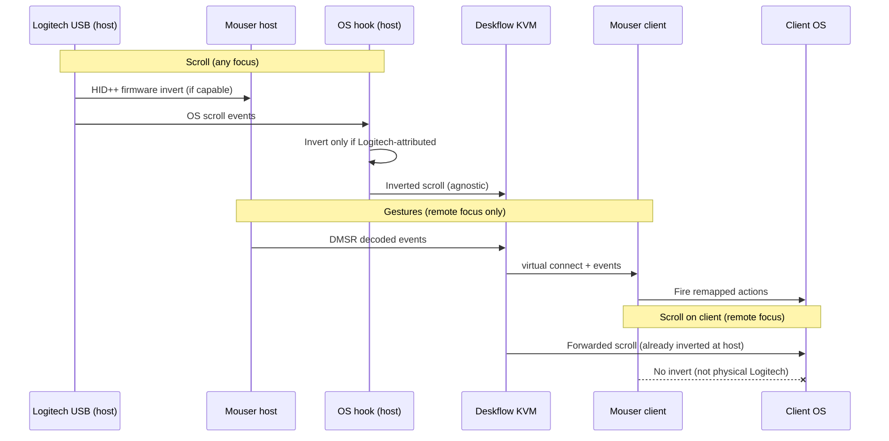

## Overview

Close the remaining gaps in the **legacy DMSR KVM path** after passthrough rollback: host scroll stays inverted during remote focus, scroll invert only touches **physically attached** Logitech mice, DMSR carries **decoded gestures/buttons only**, and all three nodes pass a log-based soak.

**Brainstorm:** [2026-07-01-kvm-scroll-invert-host-focus-brainstorm-doc.md](../brainstorm/2026-07-01-kvm-scroll-invert-host-focus-brainstorm-doc.md)

## Problem Statement

The architecture is mostly right, but several pieces are incomplete or unverified:

1. **Host scroll during remote focus** — must stay inverted (firmware + OS fallback) without Deskflow knowing.
2. **Per-event Logitech attribution** — implemented locally but **uncommitted**; without it, trackpads/generic mice can get flipped when a Logitech is connected.
3. **Client double-invert** — virtual remote device sets `_connected_device`; client OS-layer invert may re-flip KVM-forwarded scroll that was already inverted on the host.
4. **End-to-end soak** — gesture relay on clients not signed off; deploy gaps on macbookpro/tiny11.

## Target Architecture



## Key Policy (from brainstorm)

| Concern | Rule |
|---------|------|
| Host scroll invert | Always on for physical Logitech, **including remote KVM focus** |
| Client scroll invert | **Physical Logitech only** — never KVM-forwarded scroll |
| DMSR payload | Decoded `gesture_*`, `thumb_*`, `mode_shift_*`, `dpi_*` only |
| Deskflow | Agnostic to invert; forwards pointer/scroll as normal |

## Implementation Tasks

### Phase 1 — Land in-progress Mouser fixes (hackintosh first)

**Uncommitted work on `working` (commit + push):**

| File | Change |
|------|--------|
| `core/mouse_hook_base.py` | Per-event scroll gates; DMSR raw-report relay disabled |
| `core/mouse_hook_macos.py` | IOHID wheel monitor + trackpad phase filters; invert on pass-through path |
| `core/mouse_hook_windows.py` | `GetRawInputBuffer` + vendor `046d` wheel attribution |
| `core/mouse_hook_linux.py` | `linux_evdev=True` attribution |
| `tests/test_remote_forward.py`, `tests/test_wheel_divert.py` | Coverage for new gates |

- [ ] **1.1** Run `python3 -m pytest tests/test_remote_forward.py tests/test_wheel_divert.py tests/test_mouse_hook.py -q`
- [ ] **1.2** Commit: `fix(scroll): attribute wheel invert to physical Logitech only`
- [ ] **1.3** Rebuild/install Mouser on hackintosh: `python3 scripts/build_and_install.py`
- [ ] **1.4** Smoke: host invert ON, remote focus, scroll on MX → inverted on client; trackpad on host → not inverted

### Phase 2 — Physical-only client invert (code)

**Goal:** Client Mouser must not OS-invert scroll from Deskflow when only a virtual remote device is connected.

- [ ] **2.1** Add `_physical_logitech_bound()` (or extend `_logitech_device_bound()`) in `core/mouse_hook_base.py`:
  - Return `True` only when `connected_device` exists **and** `source` is not `remote-virtual` / `deskflow-shim` (and `transport != "remote"`).
  - Virtual device from `remote_device.py` uses `source="remote-virtual"` — use that as the gate.
- [ ] **2.2** Use physical-only check in `_apply_vscroll_invert_fallback` / `_apply_hscroll_invert_fallback` **on clients** (all platforms). Host (USB-attached) keeps current behavior: invert during remote focus for physical device.
  - **Host vs client detection:** `remote_forward.enabled=true` in config, or `connected_device.source` from hidapi vs remote-virtual, or `settings.remote_device` listener without local USB.
  - Simplest rule: **invert OS fallback only when `source` in (`hidapi`, `evdev`, `iokit`, …) — exclude `remote-virtual` and `deskflow-shim`.**
- [ ] **2.3** Firmware invert (`engine._apply_wheel_invert_setting`) — only run when physical HID listener owns USB (host). Skip when only virtual remote device is connected.
- [ ] **2.4** Tests:
  - Client stub: virtual `source=remote-virtual` + `invert_vscroll=true` → `_apply_vscroll_invert_fallback(cg_event=…)` returns `False`
  - Host stub: `source=hidapi` + recent wheel → returns `True`
- [ ] **2.5** UI copy (`ui/locale_manager.py`): clarify invert applies to **physically connected** Logitech on this machine.

### Phase 3 — Config + deploy (all machines)

**Host (hackintosh):**

```ini
# Deskflow.conf [server]
hidPassthroughEnabled=false
mouserBridgeEnabled=true
```

```json
// Mouser config.json
"remote_forward": { "enabled": true, "passthrough_decode_only": false }
```

**Clients (macbookpro, tiny11):**

```ini
# Deskflow.conf [client]
mouserEnabled=true
# NO hidPassthroughEnabled on server section
```

```json
// Mouser config.json
"remote_forward": { "enabled": false }
"remote_device": { "enabled": true }  // or deskflow.auto
```

- [ ] **3.1** Sync tokens across all `config.json` / `Deskflow.conf`
- [ ] **3.2** Unplug spare `046D:C52B` dongle on hackintosh
- [ ] **3.3** macbookpro: local `python3 scripts/build_and_install.py` (codesign)
- [ ] **3.4** tiny11: complete Mouser build + install; confirm no stuck local USB probe blocking `:19795` listener

### Phase 4 — Soak verification (log matrix)

**Host logs** (`~/Library/Logs/Mouser/mouser.log`):

```bash
tail -f ~/Library/Logs/Mouser/mouser.log | rg 'RemoteForward|Gesture|Focus|wheel'
```

| Step | Action | Pass |
|------|--------|------|
| H1 | Mouser start | `[RemoteForward] Connected to bridge 127.0.0.1:19796` |
| H2 | Focus → client | `[RemoteForward] Focus -> remote` |
| H3 | Scroll on MX while remote | Scroll inverted on **client** screen; host trackpad scroll **not** inverted |
| H4 | Gesture while remote | **No** `[Gesture] … [fired]` on host |
| H5 | Focus → host | Gestures fire on host again |

**Client logs:**

| Step | Pass |
|------|------|
| C1 | `[RemoteDevice] Listening on :19795` |
| C2 | Virtual connect on focus gain |
| C3 | `[Gesture] … [fired]` on client during remote focus |
| C4 | Scroll on client matches host direction (no double invert) |

**Deskflow:**

| Step | Pass |
|------|------|
| D1 | No `hid passthrough: seized` |
| D2 | DMSR activity on focus switch |

- [ ] **4.1** Run matrix on macbookpro
- [ ] **4.2** Run matrix on tiny11 (Windows Raw Input path)
- [ ] **4.3** 30-min focus-switch soak; note any IOHID timing misses on macOS

### Phase 5 — Docs cleanup

- [ ] **5.1** Update `deskflow/docs/mouser-bridge.md` — remove passthrough `decode` publish language; document scroll stays host-local
- [ ] **5.2** Append Phase 4 results to this plan or close `2026-07-01-fix-restore-legacy-dmsr-kvm-relay-plan.md`
- [ ] **5.3** README scroll/KVM bullet: physical-only invert on clients

## Acceptance Criteria

- [ ] Host scroll inverted on all screens while `invert_vscroll`/`invert_hscroll` ON, including remote KVM focus
- [ ] Trackpad and generic USB mouse scroll never inverted on host when Logitech connected
- [ ] Client scroll from shared mouse not inverted again by client Mouser
- [ ] Gestures fire on focused client only; host silent during remote focus
- [ ] No HID passthrough seize in Deskflow logs
- [ ] All three machines on `working`/`master` builds with aligned tokens

## Risks

| Risk | Mitigation |
|------|------------|
| macOS IOHID ↔ CGEvent 50 ms window miss | Prefer firmware invert on MX; soak horizontal thumbwheel |
| Windows `GetRawInputBuffer` empty | Firmware path; log when invert skipped |
| Client virtual device blocks firmware writes | Phase 2.3 — skip firmware invert without physical USB |
| tiny11 probe hang | Skip local enumerate when `remote_device` auto + no device |

## Files Reference

| Area | Path |
|------|------|
| Scroll invert gates | `core/mouse_hook_base.py` |
| macOS IOHID monitor | `core/mouse_hook_macos.py` |
| Windows wheel attribution | `core/mouse_hook_windows.py` |
| Linux evdev | `core/mouse_hook_linux.py` |
| Firmware invert | `core/engine.py` (`_apply_wheel_invert_setting`) |
| Virtual device source | `core/remote_device.py` (`source=remote-virtual`) |
| DMSR forwarder | `core/remote_forward.py` |
| Bridge docs | `deskflow/docs/mouser-bridge.md` |

## Out of Scope

- Re-enabling HID passthrough seize
- Relaying OS back/forward button remaps over DMSR
- Smart Shift / DPI state sync across KVM
