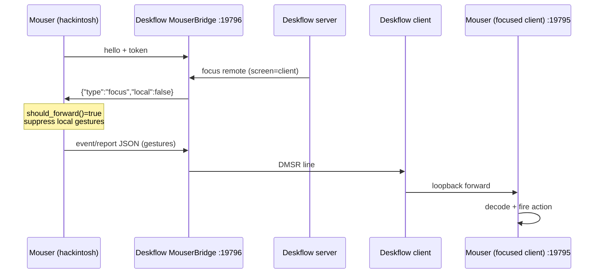

# fix: Restore legacy DMSR KVM gesture relay

**Type:** bug fix / operational rollback  
**Branch:** `working`  
**Brainstorm:** [2026-07-01-hid-passthrough-regression-brainstorm-doc.md](../brainstorm/2026-07-01-hid-passthrough-regression-brainstorm-doc.md)  
**Supersedes (for Phase 0):** [2026-06-30-feat-phase-0-kvm-transparency-live-soak-plan.md](./2026-06-30-feat-phase-0-kvm-transparency-live-soak-plan.md) — passthrough soak deferred until host-yield + client delivery are fixed.

## Problem

With Deskflow **HID passthrough enabled** and KVM focus on a remote screen:

- **Host (hackintosh)** still decodes and fires gestures (`src=hid_rawxy`, Mission Control, Next Desktop).
- **Clients (macbookpro, tiny11)** do not fire gestures despite occasional ingress attach.
- Logs show **partial seize**: device 1 seized, device 2 fails `0xe00002c5` (Mouser holds second receiver/interface).
- `RemoteForwarder(decode_only=True)` never suppresses local handling — design assumes seize removes USB access entirely.

This worked before Tier 1.5 passthrough via the **legacy DMSR relay** (`mouser-bridge.md`).

## Goal

Restore end-to-end gesture remapping on the **focused remote machine** using the legacy path, with measurable log-based verification on all three nodes.

## Non-goals (this plan)

- Fixing HID passthrough seize contention (follow-up)
- Windows tiny11 local USB probe hang (address only if legacy path still fails)
- Rebuilding Deskflow/Mouser with new features unless config rollback insufficient

## Architecture (target state)



**Passthrough path is OFF.** Host keeps exclusive USB; suppression is via `RemoteForwarder.should_forward()`, not IOHID seize.

## Phase 1 — Config rollback (all machines, ~15 min)

### 1.1 Deskflow server (hackintosh)

Edit `~/Library/Deskflow/Deskflow.conf`:

```ini
[server]
hidPassthroughEnabled=false
mouserBridgeEnabled=true
mouserBridgePort=19796
mouserBridgeToken=<shared-secret>
# Optional: leave hidPassthroughDevices in place; ignored when disabled
```

Restart Deskflow server after save.

**Expected log change:** no more `hid passthrough: seized` / `released` lines.

### 1.2 Mouser host (hackintosh)

Edit `~/Library/Application Support/Mouser/config.json`:

```json
"settings": {
  "deskflow": {
    "auto": true,
    "transparent_transport": true
  },
  "remote_forward": {
    "enabled": true,
    "host": "127.0.0.1",
    "port": 19796,
    "token": "<same as mouserBridgeToken>",
    "passthrough_decode_only": false
  },
  "remote_device": {
    "enabled": false
  }
}
```

**UI:** Keep **KVM integration toggle ON** (Scroll page) — maps to `deskflow.auto`. Do **not** disable it; that clears `remote_forward.enabled`.

Reload Mouser (quit + reopen) or trigger engine reload if running.

**Why explicit `remote_forward.enabled`:** `core/deskflow_integration.py` only sets `host_bridge` when **both** `mouserBridgeEnabled` and `hidPassthroughEnabled` are true. With passthrough off, auto-detection will **not** start the forwarder unless enabled manually.

### 1.3 Mouser clients (macbookpro, tiny11)

Ensure tokens match; clients do **not** need `remote_forward`:

```json
"settings": {
  "deskflow": { "auto": true },
  "remote_device": { "enabled": false },
  "remote_forward": { "enabled": false }
}
```

Deskflow client section (each machine):

```ini
[client]
mouserEnabled=true
mouserPort=19795
mouserToken=<shared-secret>
```

Restart Deskflow client + Mouser on each slave.

### 1.4 Hardware hygiene (recommended)

- Unplug the spare Logitech dongle (`046D:C52B`) if MX Master 4 uses `046D:C548` only — removes a class of dual-receiver confusion even on legacy path.

## Phase 2 — Live verification (log-driven soak)

Run with tails on all three machines during one gesture test session.

### Host (hackintosh)

```bash
tail -f ~/Library/Logs/Mouser/mouser.log | rg 'RemoteForward|Gesture|Focus'
tail -f ~/deskflow.log | rg 'switch|DMSR|mouser|bridge'
```

| Step | Action | Pass criteria |
|------|--------|---------------|
| H1 | Mouser starts | `[RemoteForward] Connected to bridge 127.0.0.1:19796` |
| H2 | Move cursor to tiny11 or macbookpro | `[RemoteForward] Focus -> remote (screen=...)` |
| H3 | Perform swipe gesture (hold gesture button) | **No** `[Gesture] … [fired]` on host while focus remote |
| H4 | Return cursor to hackintosh | `[RemoteForward] Focus -> local`; gestures fire on host again |

### Client (macbookpro)

```bash
tail -f ~/Library/Logs/Mouser/mouser.log | rg 'RemoteDevice|Gesture|Focus|connect'
```

| Step | Pass criteria |
|------|---------------|
| C1 | `[RemoteDevice] Listening on :19795` (or connect on focus) |
| C2 | While host focus remote to this screen: `[Gesture] … [fired]` with expected action (e.g. Mission Control) |
| C3 | No duplicate fires on host for same gesture |

### Client (tiny11)

Same as macbookpro. If log stuck on local `PID=0xC548` probe with no `[RemoteDevice] Listening`, proceed to Phase 3.

### Deskflow

Confirm screen switches correlate with focus messages; no passthrough seize warnings.

## Phase 3 — Code hardening (optional, if config drift is painful)

Only implement if Phase 1–2 pass manually but auto-config keeps regressing.

### 3.1 `host_bridge_legacy` auto-detection

**File:** `core/deskflow_integration.py`

- When `mouserBridgeEnabled=true` and `hidPassthroughEnabled=false`, set `out["host_bridge_legacy"] = True` (or reuse `host_bridge` with `passthrough: false` flag).
- **File:** `core/engine.py` `_start_remote_forwarder`
  - If `host_bridge_legacy`: `enabled=True`, `decode_only=False`
  - If `host_bridge` + passthrough: current behavior (`decode_only=True`)

### 3.2 Tests

**File:** `tests/test_deskflow_integration.py`

- Add `test_deskflow_conf_host_bridge_legacy` — bridge on, passthrough off → legacy bridge hint, not decode-only host_bridge.

**File:** `tests/test_backend.py` or engine integration test

- Assert forwarder starts with `decode_only=False` when legacy bridge detected.

### 3.3 UI clarity (low priority)

Scroll page tooltip: passthrough vs legacy relay modes — out of scope unless user confusion persists.

## Phase 4 — Deferred passthrough re-enable (separate plan)

Do **not** re-enable `hidPassthroughEnabled` until:

1. Host Mouser **yields USB** on remote focus (no reconnect to non-seized interfaces).
2. Single-receiver pinning or seize-all-interfaces on one dongle.
3. Client DFHR ingress produces `[Gesture] fired` in soak.
4. Phase 0 passthrough soak checklist passes.

Track as: `docs/plan/TBD-feat-hid-passthrough-host-yield-plan.md`.

## Acceptance criteria

- [ ] `hidPassthroughEnabled=false` on hackintosh Deskflow server
- [ ] Host `remote_forward.enabled=true`, `passthrough_decode_only=false`, token matches bridge
- [ ] With cursor on **macbookpro**: gesture fires on macbookpro only; host log shows no `[fired]` for that gesture
- [ ] With cursor on **tiny11**: same (or documented blocker + Phase 3 tiny11 fix)
- [ ] With cursor on **hackintosh**: gestures fire locally as before
- [ ] No `seize of device 2 failed (0xe00002c5)` in deskflow.log during remote focus
- [ ] Document outcome in brainstorm doc or short soak note

## Rollback

If legacy path fails:

1. Re-enable passthrough in Deskflow (previous state).
2. Set `remote_forward.enabled=false` or `passthrough_decode_only=true` per prior Tier 1.5 config.
3. Capture logs from all three nodes for follow-up.

## Risk notes

| Risk | Mitigation |
|------|------------|
| Token mismatch between machines | Single source of truth in `Deskflow.conf`; re-sync all `config.json` |
| KVM toggle OFF clears forwarder | Keep toggle ON; only disable passthrough in Deskflow |
| tiny11 stuck on local USB probe | May need client-side "skip local probe when no device" — separate fix |
| Installed Mouser.app older than `working` | Rebuild/install from `working` if `reload_kvm_integration` or deskflow auto missing |

## Files reference

| Area | Path |
|------|------|
| Forwarder logic | `core/remote_forward.py` |
| Engine startup | `core/engine.py` (`_start_remote_forwarder`) |
| Deskflow auto-detect | `core/deskflow_integration.py` |
| Hook suppression | `core/mouse_hook_base.py` (`_should_intercept_events`, `_maybe_forward_raw_report`) |
| KVM UI toggle | `ui/backend.py` (`setDeskflowIntegrationEnabled`) |
| Deskflow bridge docs | `deskflow/docs/mouser-bridge.md` |
| Passthrough docs (deferred) | `deskflow/docs/hid-passthrough.md` |

## Technical review (2026-07-01)

### Code simplicity

- Phase 1 (config-only) is the right first step — smallest surface, matches YAGNI. Phase 3 code should **not** ship until Phase 2 passes.
- Plan correctly identifies the `host_bridge` ↔ `hidPassthroughEnabled` coupling in `deskflow_integration.py:136-138` as the reason manual `remote_forward.enabled` is required.

### VGV / conventions

- Legacy suppression path is already implemented: `_hid_event_entry` + `_maybe_forward_raw_report` in `mouse_hook_base.py` gate on `should_forward()` (only when `decode_only=False`).
- Tests proposed for Phase 3 align with existing `tests/test_deskflow_integration.py` patterns.
- Restart order: **Deskflow server first**, then Mouser host (bridge must listen before forwarder connects).

### Scope / PR splitting

**No split recommended.** Phase 1 is ops-only; Phase 3 is a single focused module change if needed. Keep as one plan; optional code is a follow-up commit after soak sign-off.

### Gaps addressed

| Gap | Resolution |
|-----|------------|
| Both bridge + passthrough ON | Deskflow logs `prefer HID passthrough only` (`Server.cpp:534`) — plan disables passthrough explicitly |
| `resolve_integration()` returns None on host when passthrough off | Harmless for host; explicit `remote_forward.enabled=true` is sufficient |
| macOS overrides `_on_hid_gesture_move` without extra wrap | Base class `_start_hid_listener` wraps with `_hid_event_entry` — forwarding works on macOS |
| Client auto-start | `client_sink` from Deskflow client config still auto-enables `:19795` listener via `engine._start_remote_device_server` |

### Review verdict

**Plan is ready to execute.** Start with Phase 1–2 only; treat Phase 3 as conditional.

## Implementation checklist

- [ ] Phase 1.1 — Deskflow server config on hackintosh
- [ ] Phase 1.2 — Mouser host config on hackintosh
- [ ] Phase 1.3 — Client configs on macbookpro + tiny11
- [ ] Phase 1.4 — Unplug spare dongle (optional)
- [ ] Phase 2 — Run H1–H4, C1–C3 verification matrix
- [ ] Phase 3 — Code hardening (only if needed)
- [ ] Sign off or file tiny11 blocker
